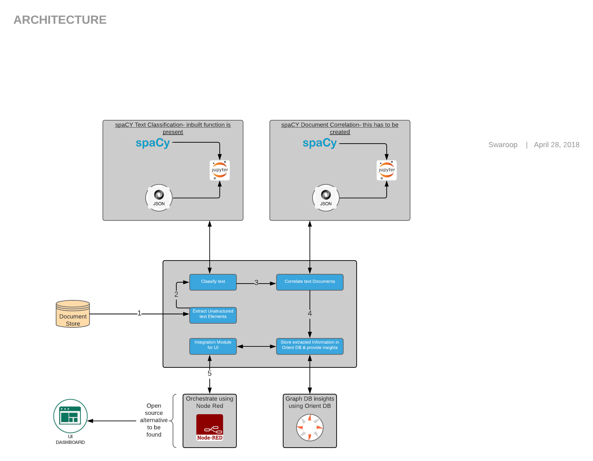
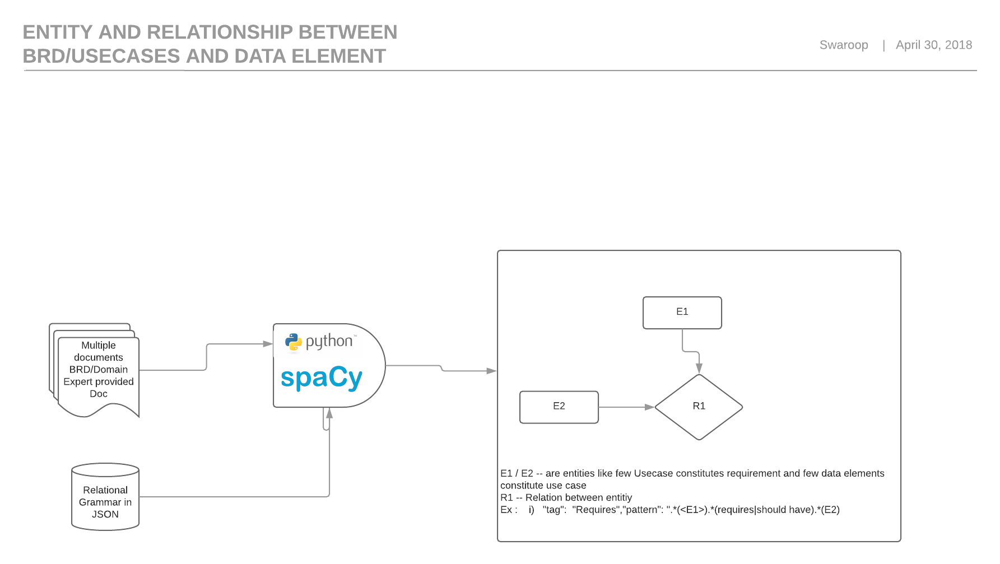
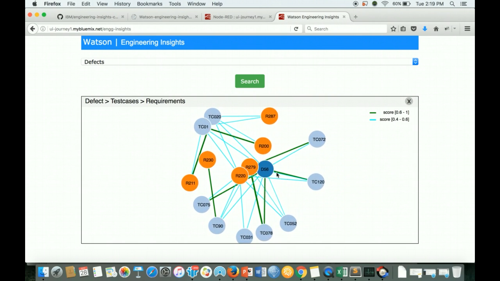

# Engineering Insights - A composite pattern. 

The problem that we address in this pattern is in the domain of software development lifecycle. In the software development lifecycle, there is a requirement to optimize project delivery lifecycle by aplication of Machine Learning. The idea is to Develop a conceptual document detailing the role of “Machine Learning” in optimizing the Design phase of project delivery.  Starting from BRD document till creation of use cases, system components etc. In long running software projects with minimal tool support and a churn of team members, the new team members face many questions: 
- What requirement does this Use case correlate to?
- What are the components/attributes i need to add for a particular requirement?
and so on.

The composite pattern demonstrates a solution to this problem using a combination of other individual code patterns.  

The main steps of the project are
- Classify the unstructured text content in the document artifacts
- Correlate the text content to find the best matching artifacts
- Store the artifact data and correlations in a graph database
- Query the graph database for insights
- Submit the request and visualize the results on a Web UI

The idea is to use an **interactive user interface using D3.js** which allows an user to drill down to get more insights on the artifacts. [D3.js](https://d3js.org/) is a JavaScript library for producing dynamic, interactive data visualizations in web browsers. It makes use of the widely implemented SVG, HTML5, and CSS standards.

1. The unstructured text data that need to be analyzed and correlated is extracted from the documents using custom python code.
2. The text is classified and tagged using the code pattern 
3. The text is correlated with other text using the code pattern 
4. The document data and correlations are stored in the Orient DB database using the code pattern
5. The analytics solution on IBM Watson Studio is invoked and visualized using the code pattern 

## Included components

* [Python and spaCy libraries](https://spacy.io/usage/spacy-101): spaCy is an open-source software library for advanced Natural Language Processing, written in the programming languages Python and Cython. It offers the fastest syntactic parser in the world

* [AWS S3 Cloud Storage](https://console.bluemix.net/catalog/infrastructure/cloud-object-storage): Amazon S3 is a web service offered by Amazon Web Services. Amazon S3 provides storage through web services interfaces 

* [Node-RED](https://nodered.org/): Node-RED is a programming tool for wiring together APIs and online services.

* [OrientDB](http://orientdb.com/orientdb/): A Multi-Model Open Source NoSQL DBMS.

## Featured technologies

# PROCESS FOR TEXT CORRELATION :

# Final Output as we propose to provide :

[See DEBUGGING.md.](DEBUGGING.md)

# License

[Apache 2.0](LICENSE)
